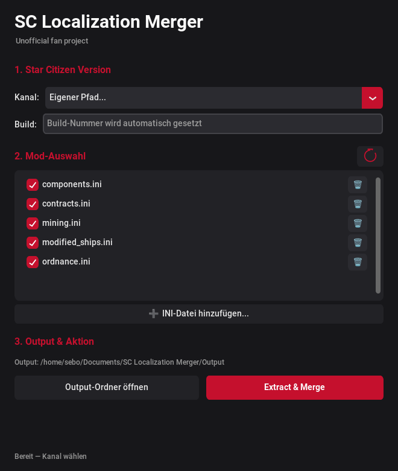

# SC Localization Merger

Ein Python-GUI-Tool auf CustomTkinter (tkinter)-Basis zum Extrahieren der *Star Citizen* `global.ini` aus einer
`Data.p4k` und zum Einmergen eigener Mod-Ini-Dateien zu einer gemeinsamen
`Output/global.ini`.

> **This is an unofficial Star Citizen fan project, not affiliated with the Cloud Imperium group of companies.**
> Für Details zu Star Citizen siehe <https://robertsspaceindustries.com>.

## Fan-Localization

Die mit diesem Tool erzeugten `Output/global.ini`-Dateien sind **Fan-Localizerungen**.
Sie sind rein inoffiziell und werden von der Community für Community-Projekte erstellt.
Die Ergebnisse stellen kein offizielles RSI/Cloud Imperium-Produkt dar.

## App-Daten-Ordner

Konfiguration (`ini/`), die `global.ini`-Inizialdatei und der `Output/`-Ordner liegen
nicht mehr im Programmverzeichnis, sondern im **App-Daten-Ordner** des Nutzers:

| OS | Pfad |
|----|------|
| Windows | `%USERPROFILE%\Documents\SC Localization Merger` |
| Linux | `~/Documents/SC Localization Merger` (Fallback: `~/.SCLocalizationMerger`) |

## Screenshot

 — *Made by the Community* (≥50 % Opacity, kein offizieller Look)

## Mod-Ini-Quellen (Community)

Deine eigenen Übersetzungs-Mods werden in den `ini/`-Ordner gelegt (je eine Datei pro
Bestandteil). Eine gute Quelle für fertige, gepflegte Community-Übersetzungen ist
**[MrKraken's StarStrings](https://github.com/MrKraken/StarStrings)**:

- Bietet eine **komplette** `global.ini`-Übersetzung sowie die **einzelnen Bestandteile**
  (z. B. Contracts, Items, Journal, Mining) als separate `.ini`-Dateien.
- Wird bei jedem SC-Patch aktualisiert — **nach jedem Update auf einen neuen Build
  prüfen** (im Readme steht „check for an update every patch").
- Download im [Releases-Bereich](https://github.com/MrKraken/StarStrings/releases)
  (`StarStrings-LIVE.zip`, auseinandergezogen nach Bedarf in den `ini/`-Ordner).
- Wenn du Teile verschiedener Übersetzungspacks kombinieren möchtest, ist zusätzlich
  **[StarMeld](https://beltakoda.github.io/StarMeld/)** (webbasiert) hilfreich.

> Hinweis: Diese Übersetzungen sind wie auch dieses Tool rein inoffizielle
> Community-Projekte — nicht verbunden mit RSI/Cloud Imperium, Nutzung auf eigene Gefahr.

## Funktionsweise

- **Mod-Ini-Dateien**: Der Ordner `ini/` enthält die `.ini`-Dateien der einzelnen Mods.
  Jede Datei kann in der GUI einzeln an- oder abgewählt werden.
- **Kanal-Auswahl**: Wähle den Installationskanal (LIVE/PTU/EPTU/… ), aus dem die
  `Data.p4k` extrahiert werden soll. Wird automatisch erkannt; "Eigener Pfad" erlaubt
  eine manuelle Auswahl des Kanal-Ordners.
- **Build-Nummer**: Die Build-Nummer wird automatisch aus dem neuesten
  `Game Build(N).log` im `logbackups/`-Ordner erkannt und kann manuell bearbeitet werden.
- **Output**: Die zusammengeführte Datei wird als `Output/global.ini` geschrieben.

## Fertige Pakete (ohne Installation)

Die gebündelte ausführbare Datei enthält alles (Python, CustomTkinter/tkinter), keine Extra-Installation nötig.

### Linux

Eine einzige ausführbare Datei, direkt per Doppelklick oder Terminal startbar:

```bash
cd "Star Citizen Localization Merger"
./dist/SC-Localization-Merger
```

- Eine Datei, statisch gebündelt via PyInstaller onefile (CustomTkinter/tkinter — deutlich kleiner als ein Qt-Build).
- Kein venv, kein pip — einfach ausführbar.

### Windows

1. Lade die neueste Version aus dem [Releases-Bereich](https://github.com/SeBoOne/SC-Localization-Merger/releases) herunter.
2. Führe `SC-Localization-Merger.exe` aus (One-File, keine Python-Installation nötig).

Der Windows-Build entsteht automatisch via GitHub-Actions, sobald ein Tag gesetzt wird
(`git tag v1.0.0 && git push origin v1.0.0`).

## Aus dem Quellcode starten (Entwicklung)

```bash
cd "Star Citizen Localization Merger"
python3 -m venv .venv
./.venv/bin/pip install customtkinter zstandard pycryptodome pyinstaller

# GUI starten
./.venv/bin/python main_gui.py

# (Optional) eigenes Linux-Bundle bauen
./.venv/bin/pyinstaller --noconfirm --clean main_gui.spec
```

## Systemvoraussetzungen (Source-Ausführung)

- **Python 3.11+** (mit **tkinter**/**Python-Tk**), **customtkinter**, **zstandard**, **pycryptodome**.

## Lizenz

Dieses Projekt ist öffentlich zugänglich.